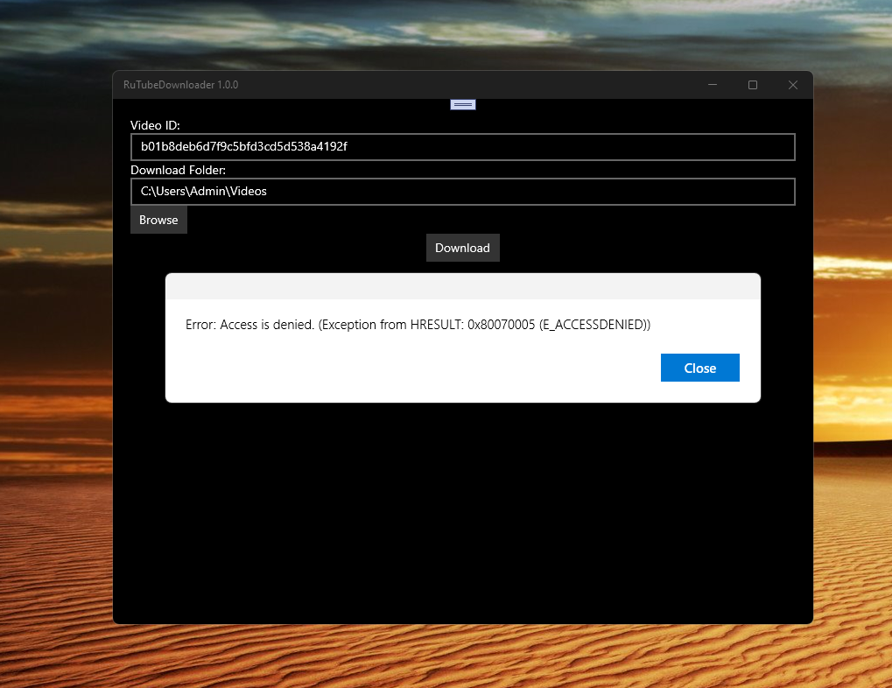

# RuTubeDownloader v1.0.0 - uwp branch

Experimental RuTubeDownloader... simplest uwp app for RuTube API micro-testin' on my old sweet Windows Family devices! ;) 

Planned as some UWP-based Russian video service (RuTube) downloader (or viewer+downloader... I don't decide yet)

## Screenshot(s)

## Status
- I made very quick and dirty .NET Standard 14 ports of RuTubeAPI+ MultiThreadedDownloaderLib (100500 bugs still there!)
- I realized draft RuTubeDownloader UWP app 
- Min. Win. OS build - 15063 (however, 10240 may be good too!))
- Work-in-progress / early bird / not ready yet!

## Known problems 
- System mulfunction (Fake Rutube API used, RutubeAPI lib not connected properly)

## ToDo
- Do User-friendly UI (call Deppseek or ChatPGPT ?))))
- Switch Min. Win. OS build to 10240 (Hello, W10M Astoria!)
- Fix wrong all RuTube api responces 
## Conclusion

## Reference(s)
- https://github.com/BlackMightyRavenDark/RuTube-downloader Original project
- https://github.com/BlackMightyRavenDark/RuTube-API Rutube API lib
- https://github.com/BlackMightyRavenDark/MultiThreadedDownloaderLib Some /MultiThreadedDownloader
- https://github.com/BlackMightyRavenDark  BlackMightyRavenDark, cool C# developer

## .
As is. No support. DIY. Learn purposes only.

## ..
[m][e] April 2025
